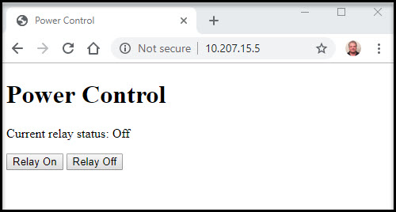
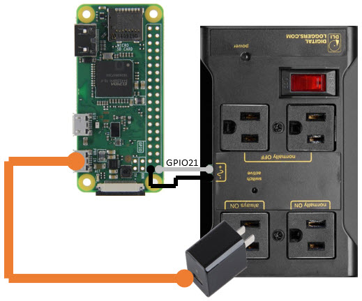

# Web-Enabled Power Strip

Based on [https://www.adafruit.com/product/2935](https://www.adafruit.com/product/2935) and a Raspberry Pi Zero.

### As seen on Adafruit Show and Tell
  
https://youtu.be/tN2z2cZIZbc?t=1365

## Controlling with the Pi Zero

You must configure the Raspberry Pi on your network for the first use. Connect a monitor/keyboard/mouse to
find your DHCP address or to configure your wireless connection. You might want to change the default
login credentials from "pi/raspberry".

To control the power, point your web-browser to the IP address. The landing page shows you the status of the 
relay. You have buttons to turn the power on and off.

You can also use `curl` to script power control with GET operations on the following URLs:

  - `/relay` Check the status of the relay ("True" or "False")
  - `/relay/on` Turn the relay on
  - `/relay/off` Turn the relay off
  

## Schematic

